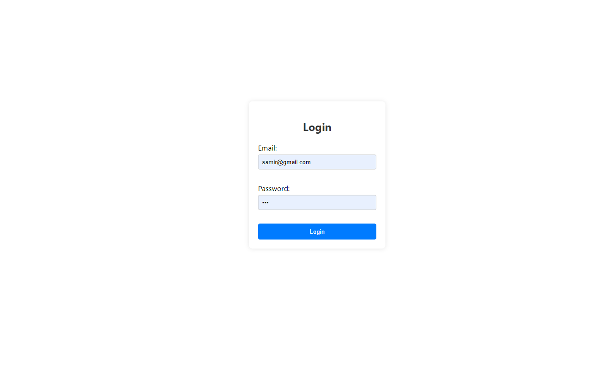
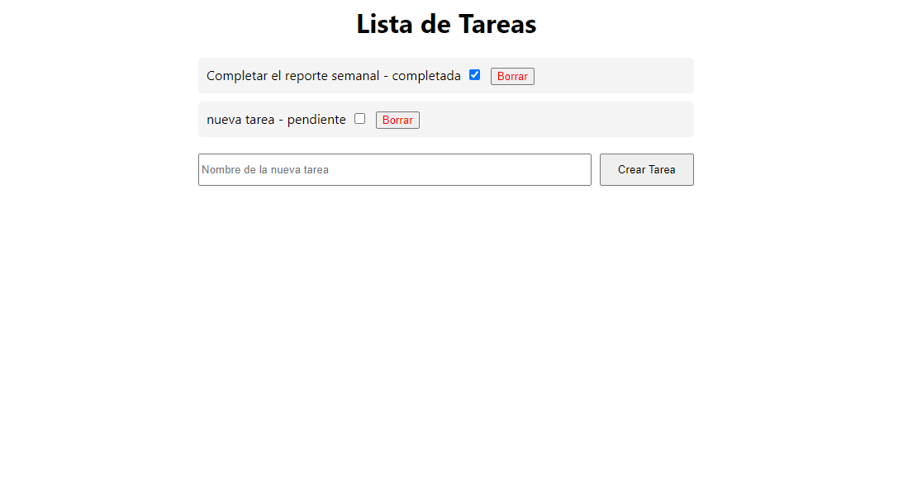
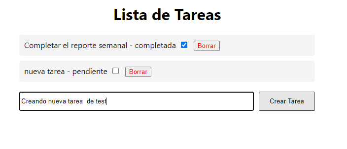
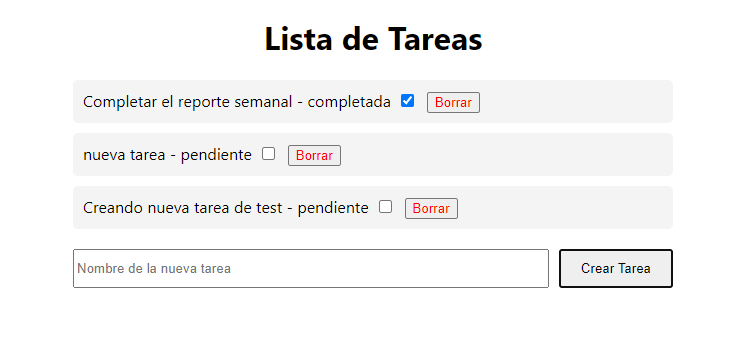
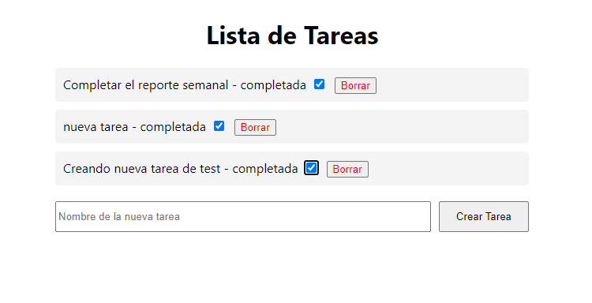
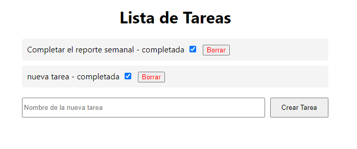

# Getting Started with Create React App

This project was bootstrapped with [Create React App](https://github.com/facebook/create-react-app).

## Available Scripts

In the project directory, you can run:
## FrontEnd Atix React

Proyecto reto tecnico Atix
## Pre-requisitos

Antes de comenzar, asegúrate de cumplir con los siguientes requisitos:
- Node.js instalado version 20.11.0
- NPM 10.2.4
- Sistema operativo compatible: Windows, Mac OS X, o Linux

## Instalación

Para instalar el proyecto, sigue estos pasos:

1. Clona el repositorio:
   ```bash
   git clone https://github.com/SamirVera/AtixTasksReact.git
   cd AtixTasksReact
2. Instala las dependencias:
   ```bash
   npm install
3. Configuración:
   ```bash
    PORT=3000
4. Ejecutar el Proyecto:
   ```bash
    Para ejecutar el proyecto en modo de desarrollo, puedes usar el siguiente comando:
    npm run start


### Aplicación

Al ingresar el app mostrará un login

1. 

Ingresando credenciales correctas se mostrará la lista de tareas creadas

2. 

La App nos permite crear tareas

3.  

Marcar la tarea como completada o pendiente

4. 

Y eliminar una tarea

5. 